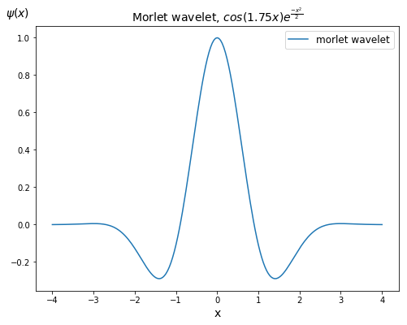
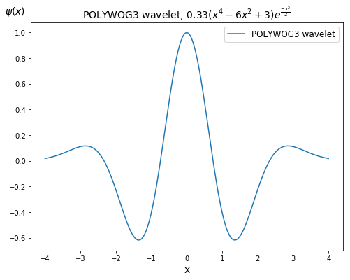

# NN_and_WNN

> 业精于勤，荒于嬉；行成于思，毁于随<a href='#fn1' name='fn1b'><sup>[1]</sup></a>。  

一个通过[反向传播算法](https://en.wikipedia.org/wiki/Backpropagation)来实现[神经网络](https://en.wikipedia.org/wiki/Artificial_neural_network)与[小波神经网络](https://pdfs.semanticscholar.org/0c8b/e141c9092ed389b9931ac09ec2e852d437c6.pdf)的 `repo`，由于未使用到 `GPU` 加速， 当网络层数较多时会导致训练比较慢，训练集也只是截取了 [mnist](http://yann.lecun.com/exdb/mnist/) 手写数据集中的 `5000` 张图片，测试集则选择了 `1000` 张。  

需要安装的库包括：
```
TensorFlow 1.12.0 (如果已下载 mnist 手写数据集则不需要)  
numpy 1.15.4  
matplotlib 2.0.2  
```

**神经网络 (Neural Network, NN)** 程序实现包含 `2` 个隐藏层的神经网络，激活函数为 `sigmoid` 函数，运行结果的笔记保存至 `jupyter notebook` 文件。  
- [code](./codes/NN.py)  
- [jupyter notebook](./notebooks/NN.ipynb)  

**小波神经网络 (Wavelet Neural Network, WNN)** 程序实现包含 `1` 个小波隐藏层的小波神经网络，激活函数为小波函数 [morlet 函数](https://www.mathworks.com/help/wavelet/ref/morlet.html)，
<div align='center'>

</div>  
包含单个隐层的小波神经网络的能力与双隐层的普通神经网络相当。更多关于小波激活函数的小波神经网络在这个 [repo](https://github.com/jswanglp/MyML/blob/master/notebooks(colab)/Neural_network_models/Supervised_learning_models/WNN.ipynb)，运行结果的笔记保存至 `jupyter notebook` 文件。  

- [code](./codes/Wavelet_NN.py)  
- [jupyter notebook](./notebooks/Wavelet_NN.ipynb)  

当隐层的小波函数为 `POLYWOG3` 小波函数<a href='#fn2' name='fn2b'><sup>[2]</sup></a>时，
<div align='center'>

</div>  
网络收敛速度明显快于普通的神经网络，精度在经过 `40` 次迭代之后达到了含双隐层的普通神经网络需要 `200` 次迭代才能达到的结果<a href='#fn3' name='fn3b'><sup>[3]</sup></a>。代码、运行结果的笔记保存至 `py` 和 `jupyter notebook` 文件。  

- [code](./codes/WNN_POLYWOG3.py)  
- [jupyter notebook](./notebooks/WNN_POLYWOG3.ipynb)  

-----
**脚注 (Footnote)**

<a name='fn1'>[1]</a>: [进学解 -- 韩愈](https://so.gushiwen.org/shiwenv_94a69d56db65.aspx)  
<a name='fn2'>[2]</a>: [Gaviphat L. Adaptive Self-Tuning Neuro Wavelet Network Controllers     // PhD thesis. Blacksburg, Virginia. 1997. 122p.](https://vtechworks.lib.vt.edu/handle/10919/30603)
<a name='fn3'>[3]</a>: [Ван Л. Петросян О.Г. Распознавание лиц на основе классификации вейвлет признаков путём вейвлет-нейронных сетей // Информатизация образования и науки. 2018. №4. С. 129-139.](https://elibrary.ru/item.asp?id=36295551)  

<a href='#fn1b'><small>↑Back to Content↑</small></a>